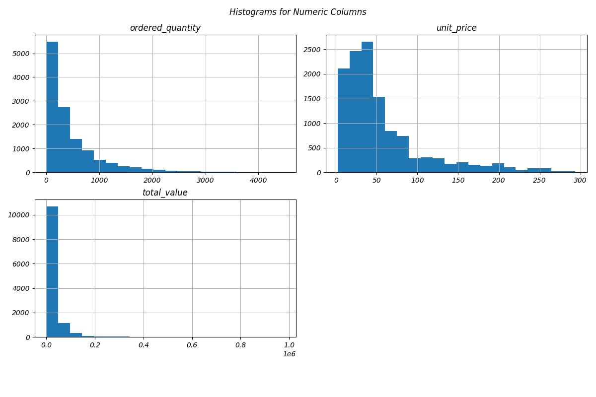
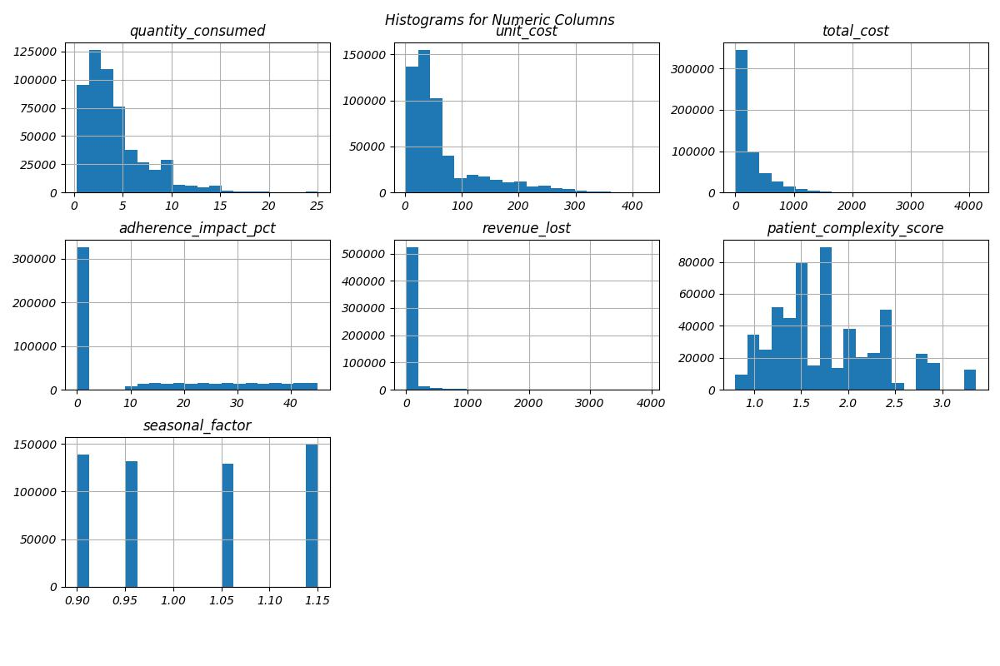

## 🏥 Hospital Data Preprocessing Script

📌 Overview
 **data preprocessing script** that reads multiple **hospital-related Excel files**, cleans them, and saves them as **structured CSVs** for further analysis and modeling.  

The datasets cover:
- Hospital Information
- Departments
- Physicians
- Patients
- SKUs (medical supplies)
- Vendors
- Inventory
- Supply Chain (Orders & Deliveries)
- Transactions
---

---

## ⚙️ Preprocessing Workflow

### 1. 📥 Data Ingestion
- Reads multiple Excel files using **pandas**.
- Each file may have multiple sheets (e.g., Hospital, Departments, Physicians).

### 2. 🧹 Data Cleaning
- **Column Standardization**
  - Strips spaces
  - Converts names to lowercase
  - Replaces spaces with underscores  
  ✅ Example: `Transaction Date` → `transaction_date`

- **Duplicate Removal**
  - Removes duplicate rows.

- **Handling Missing Data**
  - Drops rows with more than **30% missing values**.
  - Fills remaining missing values with `"Unknown"`.

- **Date/Time Conversion**
  - Attempts to convert columns containing `"date"` or `"time"` into `datetime` objects.

### 3. 💾 Data Export
- Each cleaned sheet is saved as a **separate CSV** in the output directory.
- Naming convention:  


---

## ⚙️ EDA Workflow

### 1. 🔍 Basic Dataset Information
- Shape of dataset (rows × columns)  
- Column data types  
- Missing values count  
- Duplicate row count  

📌 *Helps assess completeness and structure of the data.*

---

### 2. 📊 Descriptive Statistics
- Summary statistics for numeric columns  
- Measures of central tendency:
  
   **Mean**
  - ordered_quantity      469.018978
  - unit_price             56.532292
  - total_value         25424.139868
  
   **Median**
  - ordered_quantity      270.195
  - unit_price             39.850
  - total_value         10019.885
  
   **Mode**
  - ordered_quantity     13.05
  - unit_price           43.09
  - total_value         160.42

📌 *Highlights skewness, spread, and data quality.*

---

### 3. 📋 Categorical Analysis
- Top 3 value counts for each categorical column  
- Bar plots for the top 10 categories (for up to 3 categorical columns)  

📊 **Top 10 Categoricals in Vender ID (Bar Plot):**  


---

### 4. 🔗 Correlation Analysis
- Correlation heatmap for numeric columns  

🔥 **Heatmap:**  


---

### 5. 📈 Distribution Analysis
- **Histograms** for numeric columns → distribution shape  
- **Boxplots** for numeric columns → outlier detection  

📊 **Histogram & Box Plot:**  
!


**Box Plots Related to The Dataset**


**Maps/Plots Related to The Dataset**



---

## 📦 Requirements
Install the required Python libraries before running:

```bash
pip install pandas seaborn matplotlib
